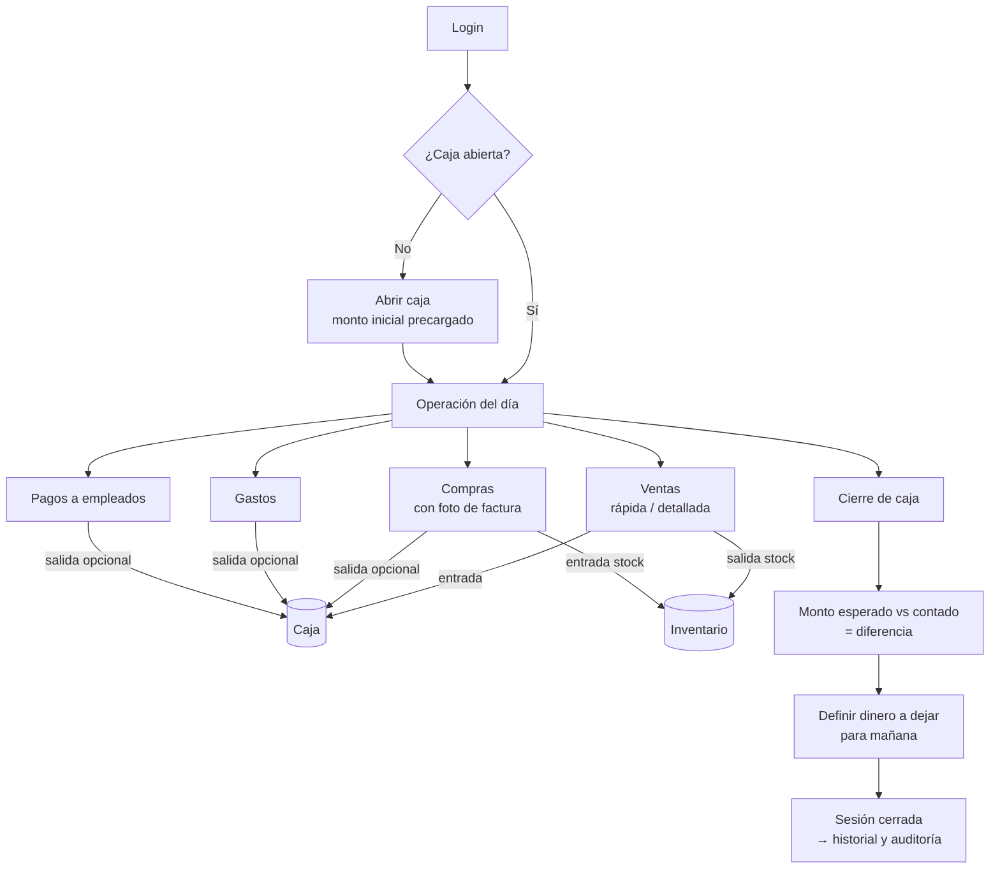
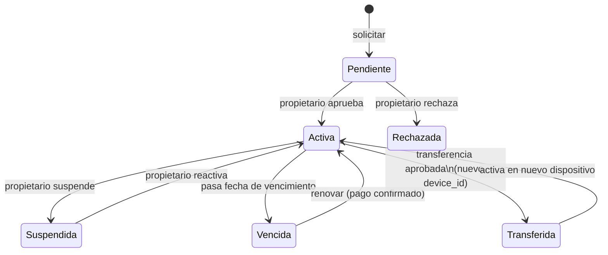
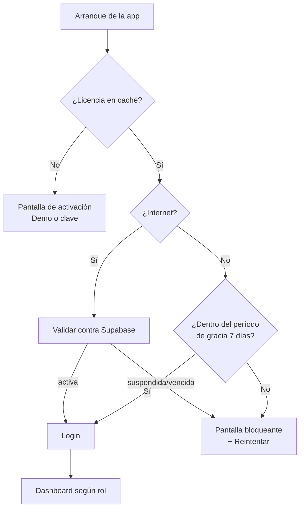
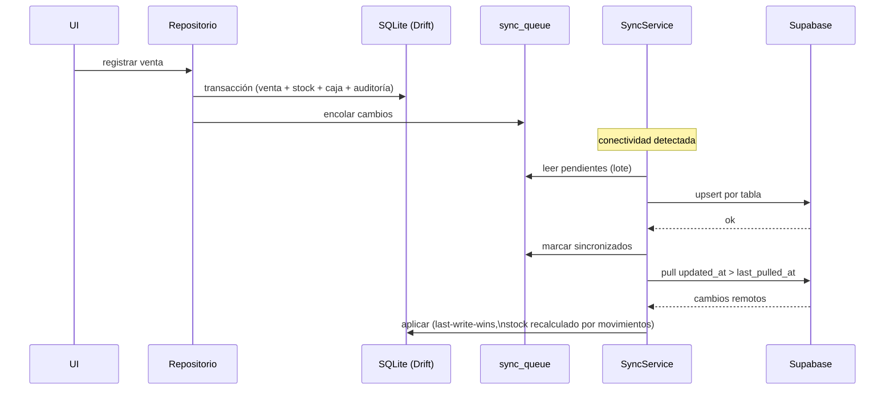

# Documento de Especificaciones Funcionales y Técnicas

**Proyecto:** App Gestión Negocios — Sistema de gestión para embutidoras, colmados y pequeños negocios alimenticios
**Versión:** 1.0 · **Fecha:** 2026-06-10 · **Estado:** Borrador para aprobación (Fase 0)
**Plataformas:** Android + iOS (Flutter) · Panel administrativo del propietario: app Flutter separada

---

## 1. Objetivos del sistema

### 1.1 Objetivo general

Proveer a embutidoras, colmados y pequeños negocios alimenticios de República Dominicana una aplicación móvil **offline-first** que digitalice la operación diaria completa: inventario, compras, ventas, caja, gastos, empleados y análisis financiero, sin depender de internet, con un modelo de licencias (Demo / Local / Nube) administrado por el propietario del sistema.

### 1.2 Objetivos específicos

| # | Objetivo |
|---|---|
| O-01 | Operar al 100% sin conexión a internet (SQLite local como fuente de verdad) |
| O-02 | Controlar inventario en tiempo real con trazabilidad total de movimientos (kárdex) |
| O-03 | Registrar ventas en mostrador en menos de 10 segundos (venta rápida) |
| O-04 | Llevar control de caja diaria con apertura, cierre y diferencias |
| O-05 | Calcular ganancia real por venta capturando el costo vigente al momento de vender |
| O-06 | Separar permisos entre Administrador y Cajero |
| O-07 | Registrar auditoría de toda acción importante (quién, qué, cuándo) |
| O-08 | Permitir respaldo/restauración completa y migración entre dispositivos (ZIP + JSON) |
| O-09 | Monetizar mediante licencias y suscripciones gestionadas por el propietario del sistema |
| O-10 | Preparar sincronización multi-dispositivo con Supabase (plan Nube) sin rediseñar el modelo de datos |

### 1.3 Fuera de alcance (versión 1.0)

- Facturación fiscal (NCF / DGII) — futuro
- Pagos electrónicos integrados (tarjeta, transferencia automática)
- Cuentas por cobrar / fiao con estados de cuenta (futuro; solo nota libre en venta)
- Multi-sucursal bajo un mismo negocio
- Impresión de tickets en impresoras térmicas (futuro)
- Web pública o e-commerce

---

## 2. Actores y roles

| Actor | Descripción | App |
|---|---|---|
| **Propietario del sistema** (app_owner) | Dueño del software. Aprueba/suspende licencias, ve negocios, pagos y estadísticas | `admin_panel` |
| **Administrador** | Dueño/encargado del negocio. Acceso total dentro de su negocio | `app_gestion` |
| **Cajero** | Empleado operativo. Vende, abre caja (si se le permite), registra gastos. No ve ganancias ni configuración | `app_gestion` |

### 2.1 Matriz de permisos (Administrador / Cajero)

| Módulo | Ver | Crear | Editar | Anular/Eliminar |
|---|---|---|---|---|
| Dashboard (con ganancia) | A | — | — | — |
| Dashboard (sin ganancia) | C | — | — | — |
| Productos | A, C | A | A | A |
| Historial de precios | A | auto | — | — |
| Inventario (existencias/kárdex) | A, C | — | — | — |
| Ajustes de inventario | A | A | — | — |
| Compras | A, C | A, C | A | A |
| Ventas | A, C | A, C | A (precio en venta detallada) | A (anular) |
| Caja: apertura | A, C | A, C | — | — |
| Caja: cierre | A (C solo con permiso en config) | — | — | — |
| Gastos | A, C | A, C | A | A |
| Empleados y Delivery | A | A | A | A |
| Pagos a empleados | A | A | — | — |
| Auditoría | A | auto (append-only) | nadie | nadie |
| Análisis financiero | A | — | — | — |
| Exportaciones | A | A | — | — |
| Respaldo / Restauración / Migración | A | A | — | — |
| Perfil del negocio y suscripción | A | — | A | — |
| Gestión de usuarios (cajeros) | A | A | A | A |
| Configuración | A | — | A | — |

`auto` = lo escribe el sistema, no el usuario.

---

## 3. Requisitos funcionales

Numerados por módulo. **Prioridad:** M = imprescindible (Must), S = deseable (Should).

### RF-LIC — Licencias (Fase 3)

| ID | Requisito | Prio |
|---|---|---|
| RF-LIC-01 | Al primer arranque la app exige activación: modo **Demo** o clave de licencia | M |
| RF-LIC-02 | Tipos de licencia: **Demo** (15 días, máx. 25 productos, sin exportaciones ni respaldo), **Local** (un dispositivo, sin nube), **Nube** (incluye sincronización multi-dispositivo) | M |
| RF-LIC-03 | La licencia se asocia a: negocio + usuario administrador + dispositivo principal (device_id) | M |
| RF-LIC-04 | La app valida la licencia contra Supabase en cada arranque con internet; sin internet usa caché local con **período de gracia de 7 días** | M |
| RF-LIC-05 | Licencia suspendida o vencida ⇒ pantalla bloqueante con mensaje y botón «Reintentar validación»; no se permite acceso a ningún módulo | M |
| RF-LIC-06 | Funciones soportadas: solicitar, activar, desactivar (libera dispositivo), transferir (requiere aprobación del propietario), suspender (solo propietario), renovar | M |
| RF-LIC-07 | La solicitud de licencia envía: nombre del negocio, teléfono, email del administrador y device_id | M |
| RF-LIC-08 | Al expirar la Demo, los datos se conservan; activar una licencia real los desbloquea | S |

### RF-PAN — Panel administrativo del propietario (Fase 4)

| ID | Requisito | Prio |
|---|---|---|
| RF-PAN-01 | Login del propietario con Supabase Auth (rol app_owner) | M |
| RF-PAN-02 | Listar negocios registrados con su licencia, plan, estado y vencimiento | M |
| RF-PAN-03 | Aprobar o rechazar solicitudes de licencia y de transferencia | M |
| RF-PAN-04 | Cambiar plan, suspender, reactivar y renovar licencias | M |
| RF-PAN-05 | Ver usuarios administradores por negocio, historial de licencia y pagos registrados | M |
| RF-PAN-06 | Estadísticas: negocios activos, licencias por tipo, vencimientos próximos (30 días), ingresos del mes | S |

### RF-AUTH — Autenticación y usuarios (Fase 5)

| ID | Requisito | Prio |
|---|---|---|
| RF-AUTH-01 | Tras activar licencia: asistente de registro del negocio + creación del usuario Administrador | M |
| RF-AUTH-02 | Login local: selector de usuario + contraseña; funciona sin internet | M |
| RF-AUTH-03 | Contraseñas con hash PBKDF2 + salt; nunca en texto plano | M |
| RF-AUTH-04 | Sesión persistente (la app recuerda al usuario hasta cerrar sesión) | M |
| RF-AUTH-05 | El Administrador crea, desactiva y resetea contraseña de Cajeros | M |
| RF-AUTH-06 | Recuperación de contraseña del Administrador vía código enviado al email registrado (requiere internet) | M |
| RF-AUTH-07 | Bloqueo temporal de 1 minuto tras 5 intentos fallidos consecutivos | S |

### RF-DSH — Dashboard (Fase 6)

| ID | Requisito | Prio |
|---|---|---|
| RF-DSH-01 | Mostrar: estado de caja actual (abierta/cerrada + monto), ventas del día, ventas del mes, compras del mes, gastos del mes | M |
| RF-DSH-02 | Ganancia del mes visible **solo para Administrador** | M |
| RF-DSH-03 | Lista de productos con inventario bajo (stock ≤ stock mínimo) | M |
| RF-DSH-04 | Últimos movimientos (ventas, compras y gastos recientes mezclados) | M |
| RF-DSH-05 | Accesos rápidos: Vender, Comprar, Caja | M |
| RF-DSH-06 | Actualización reactiva: cualquier registro nuevo refresca el dashboard sin recargar | M |

### RF-PRD — Productos e historial de precios (Fase 7)

| ID | Requisito | Prio |
|---|---|---|
| RF-PRD-01 | CRUD de productos: nombre, categoría, unidad (unidad/libra/caja/paquete…), precio de compra, precio de venta, stock mínimo, estado | M |
| RF-PRD-02 | CRUD de categorías (inline desde el formulario de producto) | M |
| RF-PRD-03 | Búsqueda por nombre y filtro por categoría/estado | M |
| RF-PRD-04 | Todo cambio de precio (compra o venta) genera registro en historial de precios: precio anterior, nuevo, usuario, fecha | M |
| RF-PRD-05 | Historial de precios consultable desde el detalle del producto | M |
| RF-PRD-06 | Eliminación = desactivación (soft delete); el producto conserva su historial | M |
| RF-PRD-07 | Stock inicial al crear producto genera movimiento de inventario tipo «stock inicial» | M |

### RF-INV — Inventario (Fase 8)

| ID | Requisito | Prio |
|---|---|---|
| RF-INV-01 | Pantalla de existencias: stock actual, valor a costo, alerta visual de stock bajo | M |
| RF-INV-02 | Kárdex por producto: fecha, tipo de movimiento, cantidad, stock resultante, usuario, motivo/referencia | M |
| RF-INV-03 | Ajuste manual (entrada/salida) con **motivo obligatorio** y usuario registrado; solo Administrador | M |
| RF-INV-04 | El stock SOLO cambia mediante movimientos de inventario (compra, venta, ajuste, stock inicial, anulación) | M |

### RF-COM — Compras (Fase 9)

| ID | Requisito | Prio |
|---|---|---|
| RF-COM-01 | Registrar compra: proveedor (selector con alta rápida), número de factura, foto de la factura, líneas de producto con cantidad y costo unitario | M |
| RF-COM-02 | Guardar compra actualiza inventario automáticamente (entrada por línea) en una sola transacción | M |
| RF-COM-03 | Si el costo unitario difiere del precio de compra vigente, se actualiza el producto y se registra en historial de precios | M |
| RF-COM-04 | Opción «pagada con efectivo de caja» registra salida en la caja abierta | M |
| RF-COM-05 | Lista de compras con filtros por fecha y proveedor; detalle con foto ampliable | M |
| RF-COM-06 | Anular compra (solo Administrador): revierte inventario y caja, conserva el registro como anulado | S |

### RF-VEN — Ventas (Fase 10)

| ID | Requisito | Prio |
|---|---|---|
| RF-VEN-01 | **Venta rápida:** cuadrícula táctil de productos con búsqueda, tap suma al carrito, total grande, cobro con monto recibido y cálculo de cambio | M |
| RF-VEN-02 | **Venta detallada:** línea por línea, edición de cantidades, nota opcional; modificación de precio solo Administrador | M |
| RF-VEN-03 | Vender requiere caja abierta; si está cerrada, se ofrece abrirla en el momento | M |
| RF-VEN-04 | La venta descuenta stock y registra entrada en caja en la misma transacción | M |
| RF-VEN-05 | Cada línea captura el costo unitario vigente; ganancia = Σ (precio − costo) × cantidad | M |
| RF-VEN-06 | Advertencia con stock insuficiente; venta con stock negativo solo si el Administrador lo habilitó en configuración | M |
| RF-VEN-07 | Anular venta (solo Administrador): revierte stock y caja; la venta queda en estado «anulada», nunca se borra | M |
| RF-VEN-08 | Toda venta y anulación queda en auditoría con usuario y fecha | M |

### RF-CAJ — Caja (Fase 11)

| ID | Requisito | Prio |
|---|---|---|
| RF-CAJ-01 | Apertura con monto inicial, precargado con el «dinero dejado» del último cierre | M |
| RF-CAJ-02 | Solo puede existir una sesión de caja abierta a la vez | M |
| RF-CAJ-03 | Movimientos del día en vivo: ventas (entrada), gastos y compras de caja (salida), entradas/salidas manuales con motivo | M |
| RF-CAJ-04 | Cierre: muestra monto esperado (apertura + entradas − salidas), pide monto contado, calcula diferencia (sobrante/faltante) | M |
| RF-CAJ-05 | Al cerrar se define el **dinero a dejar para el día siguiente**; el resto se registra como retiro | M |
| RF-CAJ-06 | Historial de sesiones con quién abrió/cerró y diferencias resaltadas | M |
| RF-CAJ-07 | Cierre restringido a Administrador, salvo permiso explícito a cajeros en configuración | M |

### RF-GAS — Gastos (Fase 12)

| ID | Requisito | Prio |
|---|---|---|
| RF-GAS-01 | Registrar gasto: categoría (predefinidas: luz, agua, alquiler, transporte, otros + personalizadas), concepto, fecha, monto | M |
| RF-GAS-02 | Opción «sale de caja» registra salida en la caja abierta | M |
| RF-GAS-03 | Lista con filtros por mes y categoría, con total del período | M |
| RF-GAS-04 | Los gastos alimentan dashboard y análisis financiero | M |

### RF-EMP — Empleados y Delivery (Fase 13)

| ID | Requisito | Prio |
|---|---|---|
| RF-EMP-01 | Dos secciones: Empleados de ventas y Delivery (misma ficha, tipo distinto) | M |
| RF-EMP-02 | Ficha: foto, nombre, cédula (formato RD 000-0000000-0), dirección, teléfono, fecha de ingreso, estado, salario, frecuencia/fecha de pago | M |
| RF-EMP-03 | Registrar pago: fecha, monto, período cubierto; opcional salida de caja | M |
| RF-EMP-04 | Por empleado: historial de pagos, total pagado acumulado y tiempo trabajado (calculado, ej. «2 años, 3 meses») | M |
| RF-EMP-05 | Módulo exclusivo del Administrador | M |

### RF-AUD — Auditoría (Fase 14)

| ID | Requisito | Prio |
|---|---|---|
| RF-AUD-01 | Registrar por cada acción importante: usuario, acción, módulo, entidad afectada, datos antes/después (JSON), fecha-hora | M |
| RF-AUD-02 | Acciones auditadas: CUD de productos, cambios de precio, ajustes de inventario, compras, ventas, anulaciones, apertura/cierre de caja, gastos, empleados, pagos, usuarios, licencia, respaldos/restauraciones | M |
| RF-AUD-03 | Consulta (solo Administrador) con filtros por usuario, módulo, acción y rango de fechas; detalle con diff legible | M |
| RF-AUD-04 | Append-only: la auditoría no puede editarse ni borrarse desde la app, ni por el Administrador | M |

### RF-ANL — Análisis financiero (Fase 15)

| ID | Requisito | Prio |
|---|---|---|
| RF-ANL-01 | Históricos con selector de rango (mes/trimestre/año/todo): ventas, compras, gastos, sueldos pagados, ganancia, dinero total movido | M |
| RF-ANL-02 | Valor actual del inventario (Σ stock × costo) | M |
| RF-ANL-03 | Rankings: producto más vendido (unidades), más rentable (ganancia acumulada), menos vendido; empleado con más antigüedad; total pagado por empleado | M |
| RF-ANL-04 | Gráficas: línea ventas vs gastos por mes, barras de ganancia mensual, pastel de gastos por categoría | M |
| RF-ANL-05 | Comparativa mes actual vs mes anterior con % de variación | M |
| RF-ANL-06 | Módulo exclusivo del Administrador | M |

### RF-EXP — Exportaciones (Fase 16)

| ID | Requisito | Prio |
|---|---|---|
| RF-EXP-01 | Formatos: Excel (.xlsx), PDF y CSV | M |
| RF-EXP-02 | Exportables: ventas por rango (con líneas), compras, inventario valorizado, empleados y pagos, reporte de cierre de caja, resumen mensual (PDF con logo y datos del negocio) | M |
| RF-EXP-03 | Compartir el archivo generado por WhatsApp, email o guardar en el dispositivo | M |
| RF-EXP-04 | No disponible en plan Demo | M |

### RF-RES — Respaldo y migración (Fase 17)

| ID | Requisito | Prio |
|---|---|---|
| RF-RES-01 | Exportar respaldo completo: ZIP con manifest.json (versión de schema, fecha, negocio, versión de app) + JSON por tabla + carpeta media (fotos) | M |
| RF-RES-02 | Restaurar respaldo: advertencia destructiva + confirmación escribiendo el nombre del negocio; restauración transaccional total | M |
| RF-RES-03 | Historial de respaldos realizados (fecha, archivo, tamaño, resultado) | M |
| RF-RES-04 | Migrar dispositivo: respaldo en origen → restaurar en destino → solicitud de transferencia de licencia (device_id distinto) aprobada por el propietario | M |
| RF-RES-05 | Restaurar respaldos de versiones de schema anteriores aplicando transformaciones de migración | S |
| RF-RES-06 | No disponible en plan Demo | M |

### RF-PER — Perfil y suscripciones (Fase 18)

| ID | Requisito | Prio |
|---|---|---|
| RF-PER-01 | Perfil del negocio: nombre, ID, logo, datos de contacto (editable por Administrador) | M |
| RF-PER-02 | Mostrar: plan actual, estado, fecha de activación, próximo vencimiento | M |
| RF-PER-03 | Historial de pagos de la suscripción (desde Supabase) | M |
| RF-PER-04 | Alertas de renovación: banner en dashboard desde 15 días antes del vencimiento + notificación local | M |
| RF-PER-05 | Renovación manual: botón «Renovar» genera solicitud que el propietario confirma desde su panel; al confirmarse, el vencimiento se extiende y la app lo refleja al revalidar | M |

### RF-SYN — Sincronización (Fase 19)

| ID | Requisito | Prio |
|---|---|---|
| RF-SYN-01 | SQLite es la fuente principal; la app funciona al 100% sin internet | M |
| RF-SYN-02 | Sincronizar con Supabase: productos, ventas, compras, movimientos de inventario, empleados, gastos, caja y configuración | M |
| RF-SYN-03 | Push por cola de sincronización (cada escritura encola); pull incremental por updated_at | M |
| RF-SYN-04 | Conflictos: last-write-wins por updated_at; el stock nunca se sincroniza como valor — se sincronizan movimientos y se recalcula; ventas/compras/auditoría son append-only | M |
| RF-SYN-05 | Indicador de estado de sync (sincronizado / N pendientes / sin conexión) con pantalla de detalle y reintentos | M |
| RF-SYN-06 | Sync activo únicamente con licencia tipo Nube | M |

---

## 4. Requisitos no funcionales

| ID | Categoría | Requisito |
|---|---|---|
| RNF-01 | Disponibilidad | Operación completa offline; internet solo para licencias, recuperación de contraseña del admin y sync |
| RNF-02 | Rendimiento | Venta rápida: registrar una venta de 3 productos en ≤ 10 s. Listas de hasta 5,000 productos con búsqueda fluida (< 200 ms) |
| RNF-03 | Rendimiento | Dashboard y análisis usan consultas SQL agregadas, nunca cálculo en memoria sobre tablas completas |
| RNF-04 | Seguridad | Contraseñas con PBKDF2 + salt; sesión y licencia en almacenamiento seguro del SO; claves de Supabase nunca hardcodeadas (AG-CORE-004) |
| RNF-05 | Seguridad | RLS en Supabase: cada negocio solo accede a sus datos; rol app_owner para el propietario |
| RNF-06 | Integridad | Operaciones compuestas (venta, compra, cierre de caja, restauración) son transaccionales: todo o nada |
| RNF-07 | Integridad | Dinero en centavos (INTEGER); prohibido punto flotante en montos |
| RNF-08 | Trazabilidad | Toda acción importante queda en auditoría con usuario y timestamp |
| RNF-09 | Usabilidad | UI táctil para mostrador: botones grandes, alto contraste, textos en español RD, formato RD$ 1,250.00 |
| RNF-10 | Portabilidad | Android 8.0+ e iOS 13+; respaldo restaurable entre plataformas |
| RNF-11 | Mantenibilidad | Clean Architecture por feature; migraciones de schema versionadas (Drift schemaVersion) |
| RNF-12 | Sync-ready | UUIDs, updated_at UTC y soft delete en todas las tablas sincronizables desde la v1 |
| RNF-13 | Calidad | `flutter analyze` sin warnings y tests verdes como gate de cada fase; cálculos de dinero siempre con test unitario |

---

## 5. Reglas de negocio

| ID | Regla |
|---|---|
| RN-01 | No se puede registrar una venta sin caja abierta |
| RN-02 | Una venta descuenta stock, registra entrada de caja y captura costos en la misma transacción |
| RN-03 | El stock solo cambia mediante movimientos de inventario; nunca se edita directamente |
| RN-04 | Todo cambio de precio (compra o venta) crea una entrada en el historial de precios |
| RN-05 | La ganancia de una venta se calcula con el costo vigente al momento de vender, no con el costo actual |
| RN-06 | El Cajero no ve ganancias, análisis financiero, empleados, auditoría, respaldos ni configuración |
| RN-07 | Solo puede haber una sesión de caja abierta a la vez |
| RN-08 | El cierre de caja calcula diferencia = monto contado − monto esperado; queda registrada aunque sea cero |
| RN-09 | El dinero a dejar definido en el cierre precarga la apertura siguiente |
| RN-10 | Ventas y compras nunca se borran: se anulan, revirtiendo stock y caja |
| RN-11 | Anular ventas o compras es exclusivo del Administrador |
| RN-12 | Venta con stock insuficiente: advertir siempre; permitir solo si el Administrador habilitó stock negativo |
| RN-13 | Productos, empleados, gastos y proveedores se desactivan (soft delete); conservan historial |
| RN-14 | La auditoría es append-only para todos los roles |
| RN-15 | Licencia suspendida o vencida bloquea el acceso total con mensaje; los datos locales se conservan |
| RN-16 | Sin internet, la licencia activa opera con período de gracia de 7 días desde la última validación |
| RN-17 | La licencia Demo dura 15 días, limita a 25 productos y deshabilita exportaciones y respaldo |
| RN-18 | Transferir licencia a otro dispositivo requiere aprobación del propietario del sistema |
| RN-19 | El ajuste manual de inventario exige motivo obligatorio y queda asociado al usuario |
| RN-20 | Un pago a empleado registra el período cubierto y puede descontar de caja si así se indica |
| RN-21 | La restauración de respaldo reemplaza TODOS los datos locales previa doble confirmación |
| RN-22 | En sync, el stock se reconstruye desde movimientos; nunca se acepta un valor de stock remoto |
| RN-23 | Importes siempre en DOP (RD$); v1 es mono-moneda |

---

## 6. Casos de uso principales

Formato: actor · precondición · flujo principal · flujos alternativos.

### CU-01 — Activar licencia
- **Actor:** Administrador (primer uso)
- **Pre:** App recién instalada, sin licencia
- **Flujo:** 1) Abre la app → pantalla de activación. 2) Elige «Demo» o ingresa clave. 3) Con clave: la app envía clave + device_id a Supabase. 4) Respuesta «activa» → guarda caché local → pasa a registro del negocio (CU-02).
- **Alternativos:** A1: Sin internet y con clave → mensaje «se requiere conexión para activar». A2: Clave suspendida/inválida → mensaje y permanece bloqueada. A3: Demo → activación local inmediata sin internet.

### CU-02 — Registrar negocio y administrador
- **Actor:** Administrador
- **Pre:** Licencia activada, sin negocio registrado
- **Flujo:** 1) Asistente: nombre del negocio, teléfono, dirección, logo opcional. 2) Crea usuario admin: nombre, username, contraseña (×2). 3) Sistema hashea contraseña, crea negocio + usuario, audita y entra al dashboard.

### CU-03 — Iniciar sesión
- **Actor:** Administrador / Cajero
- **Pre:** Negocio registrado, usuario activo
- **Flujo:** 1) Selector de usuario. 2) Contraseña. 3) Validación local → sesión persistida → dashboard según rol.
- **Alternativos:** A1: 5 fallos → bloqueo 1 min. A2: Usuario desactivado → mensaje «contacte al administrador».

### CU-04 — Abrir caja
- **Actor:** Administrador o Cajero
- **Pre:** Sin sesión de caja abierta
- **Flujo:** 1) Caja → «Abrir». 2) Monto inicial precargado con el dinero dejado del último cierre, editable. 3) Confirma → sesión abierta, auditada.
- **Alternativos:** A1: Ya hay caja abierta → se muestra la sesión activa.

### CU-05 — Venta rápida
- **Actor:** Cajero / Administrador
- **Pre:** Caja abierta, productos activos
- **Flujo:** 1) «Vender» → cuadrícula. 2) Tap por producto (repetir suma cantidad). 3) «Cobrar» → total; ingresa monto recibido → muestra cambio. 4) Confirma → transacción: venta + líneas con costo capturado + descuento de stock + entrada de caja + auditoría.
- **Alternativos:** A1: Caja cerrada → diálogo «abrir caja ahora». A2: Stock insuficiente → advertencia (bloquea o permite según RN-12). A3: Cancelar limpia el carrito.

### CU-06 — Venta detallada
- Igual a CU-05 con: edición de cantidades por línea, nota opcional y cambio de precio por línea (solo Administrador).

### CU-07 — Registrar compra con factura
- **Actor:** Administrador (Cajero si se le permite)
- **Pre:** Al menos un producto activo
- **Flujo:** 1) «Comprar» → proveedor (o alta rápida). 2) Nº de factura + foto (cámara/galería). 3) Líneas: producto, cantidad, costo unitario. 4) Opcional «pagada de caja». 5) Guardar → transacción: compra + entradas de inventario + actualización de costos con historial + salida de caja si aplica + auditoría.

### CU-08 — Ajuste de inventario
- **Actor:** Administrador
- **Flujo:** 1) Inventario → producto → «Ajustar». 2) Entrada o salida + cantidad + **motivo obligatorio**. 3) Confirmar → movimiento con stock resultante + auditoría.

### CU-09 — Cerrar caja
- **Actor:** Administrador (Cajero solo con permiso)
- **Pre:** Caja abierta
- **Flujo:** 1) Caja → «Cerrar». 2) Sistema muestra esperado (apertura + entradas − salidas). 3) Ingresa monto contado → diferencia visible. 4) Define dinero a dejar para mañana. 5) Confirma → sesión cerrada con retiro calculado + auditoría.
- **Alternativos:** A1: Diferencia ≠ 0 → se resalta y pide confirmación adicional.

### CU-10 — Pagar a empleado
- **Actor:** Administrador
- **Flujo:** 1) Empleados → ficha → «Registrar pago». 2) Fecha, monto (precargado con salario), período. 3) Opcional «sale de caja». 4) Confirma → pago en historial + total pagado actualizado + salida de caja si aplica + auditoría.

### CU-11 — Anular venta
- **Actor:** Administrador
- **Pre:** Venta en estado «completada»
- **Flujo:** 1) Detalle de venta → «Anular» + motivo. 2) Confirmación. 3) Transacción: estado anulada + reversa de stock + reversa de caja + auditoría con datos antes/después.

### CU-12 — Restaurar respaldo
- **Actor:** Administrador
- **Flujo:** 1) Respaldo → «Restaurar» → selecciona ZIP. 2) Sistema valida manifest (versión de schema). 3) Advertencia destructiva: confirmar escribiendo el nombre del negocio. 4) Restauración transaccional de datos + fotos. 5) Reinicio de sesión.
- **Alternativos:** A1: Schema más nuevo que la app → rechazo con mensaje de actualizar la app. A2: ZIP corrupto → error sin tocar datos.

### CU-13 — Aprobar licencia (panel del propietario)
- **Actor:** Propietario del sistema
- **Flujo:** 1) Panel → «Solicitudes». 2) Revisa datos del negocio. 3) Asigna tipo y vigencia → «Aprobar». 4) Supabase genera/activa la licencia. 5) La app del negocio queda activa en la siguiente validación.

### CU-14 — Suspender licencia
- **Actor:** Propietario del sistema
- **Flujo:** 1) Panel → negocio → «Suspender» + motivo. 2) En la siguiente validación (arranque con internet o fin del período de gracia) la app queda bloqueada con mensaje.

### CU-15 — Sincronizar (plan Nube)
- **Actor:** Sistema (automático)
- **Pre:** Licencia Nube activa, cambios pendientes en cola
- **Flujo:** 1) Conectividad detectada → push de cola en lotes. 2) Pull incremental por updated_at. 3) Conflictos por last-write-wins (RN-22 para stock). 4) Indicador pasa a «sincronizado».
- **Alternativos:** A1: Error de red → reintento con backoff; los datos locales nunca se pierden.

---

## 7. Restricciones

| ID | Restricción |
|---|---|
| RE-01 | Stack fijo: Flutter + Riverpod + Drift/SQLite + Supabase; Clean Architecture + Repository Pattern |
| RE-02 | Orden de desarrollo estricto por fases 0→19; una fase no inicia sin la anterior compilando, funcionando y probada |
| RE-03 | Sin servidor propio: todo lo remoto vive en Supabase (Auth, Postgres, RLS, Edge Functions, Storage) |
| RE-04 | El panel del propietario es una app móvil Flutter separada (`admin_panel/`), no web |
| RE-05 | v1 mono-negocio por instalación y mono-moneda (DOP) |
| RE-06 | Pagos de suscripción fuera de la app (efectivo/transferencia); el propietario los registra manualmente en su panel |
| RE-07 | Las fotos se almacenan en el sandbox de la app; se incluyen en el respaldo |

---

## 8. Diagramas

### 8.1 Flujo completo del negocio (día típico)

### 8.2 Estados de la licencia

### 8.3 Arranque y validación de licencia

### 8.4 Sincronización offline-first (plan Nube)

### 8.5 ERD

El diagrama entidad-relación completo se documenta en la Fase 2 → [MODELO_DATOS.md](MODELO_DATOS.md).

---

## 9. Trazabilidad fases → requisitos

| Fase | Entrega | Requisitos cubiertos |
|---|---|---|
| F1 | Arquitectura Flutter | RNF-11 |
| F2 | Modelo de datos | RNF-07, RNF-12 |
| F3 | Licencias | RF-LIC-*, RN-15..18 |
| F4 | Panel propietario | RF-PAN-*, CU-13, CU-14 |
| F5 | Autenticación | RF-AUTH-*, RNF-04 |
| F6 | Dashboard | RF-DSH-* |
| F7 | Productos | RF-PRD-*, RN-04, RN-13 |
| F8 | Inventario | RF-INV-*, RN-03, RN-19 |
| F9 | Compras | RF-COM-* |
| F10 | Ventas | RF-VEN-*, RN-01..05, RN-10..12 |
| F11 | Caja | RF-CAJ-*, RN-07..09 |
| F12 | Gastos | RF-GAS-* |
| F13 | Empleados/Delivery | RF-EMP-*, RN-20 |
| F14 | Auditoría | RF-AUD-*, RN-14, RNF-08 |
| F15 | Análisis | RF-ANL-*, RNF-03 |
| F16 | Exportaciones | RF-EXP-* |
| F17 | Respaldo/Migración | RF-RES-*, RN-21 |
| F18 | Perfil/Suscripciones | RF-PER-* |
| F19 | Sincronización | RF-SYN-*, RN-22, RNF-01 |

---

*Documento maestro del proyecto. Toda fase posterior se valida contra este documento. Cambios de alcance requieren actualizar este archivo primero.*
