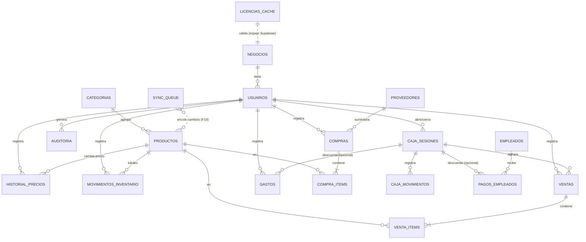

# Modelo de Datos — Schema v1

**Motor:** SQLite vía Drift · **Definición:** `lib/core/database/tables/` · **Registro:** `lib/core/database/app_database.dart`
**Requisitos base:** RNF-07 (centavos), RNF-12 (sync-ready), RN-03 (kárdex), RN-13 (soft delete), RN-14 (auditoría append-only).

## 1. Decisiones de diseño

| Decisión | Implementación | Razón |
|---|---|---|
| PK | `id TEXT` UUID v4 (`clientDefault` → `generateUuidV4`, `tables/base.dart`) | Sync multi-dispositivo sin colisiones (F19) |
| Dinero | `INTEGER` en centavos (`precio*`, `monto*`, `total`, `ganancia`, `salario`) | Sin punto flotante en montos; helper `Money` |
| Cantidades | `REAL` (`cantidad`, `stock*`) | Productos pesables (libras) admiten fracciones |
| Timestamps | `created_at`/`updated_at` TEXT ISO-8601 UTC (`build.yaml: store_date_time_values_as_text`) | Resolución de conflictos last-write-wins |
| Soft delete | `deleted_at` nullable en usuarios, categorías, productos, proveedores, gastos, empleados | Los deletes se propagan en sync; conservan historial |
| Enums | TEXT con el nombre del enum (`textEnum<T>()`, `enums.dart`) | Legible en SQL y estable entre versiones |
| FKs | `PRAGMA foreign_keys = ON` en `beforeOpen` | SQLite las trae apagadas por defecto |
| Signos | `movimientos_inventario.cantidad` y `caja_movimientos.monto` CON signo | `stock = SUM(cantidad)`; arqueo = `apertura + SUM(monto)` |

## 2. ERD

## 3. Tablas (21)

### Negocio y acceso
| Tabla | Campos clave | Notas |
|---|---|---|
| `negocios` | nombre, identificacion, direccion, telefono, email, logo_path, moneda='DOP' | 1 por instalación (RE-05) |
| `usuarios` | negocio_id FK, nombre, **username UNIQUE**, password_hash, salt, rol{administrador,cajero}, activo, soft delete | hash PBKDF2 (RF-AUTH-03) |
| `licencias_cache` | tipo{demo,local,nube}, estado{pendiente,activa,suspendida,vencida,transferida}, clave, device_id, fecha_activacion, fecha_vencimiento, ultima_validacion | espejo local de Supabase; período de gracia (RN-16) |
| `configuraciones` | **clave PK**, valor, updated_at | key-value: `permitir_stock_negativo`, `cajero_puede_cerrar_caja`… |

### Catálogo e inventario
| Tabla | Campos clave | Notas |
|---|---|---|
| `categorias` | nombre, soft delete | |
| `productos` | nombre, categoria_id FK?, unidad, precio_compra ¢, precio_venta ¢, stock_actual, stock_minimo, activo, soft delete | stock replicado por rendimiento; fuente de verdad = kárdex |
| `historial_precios` | producto_id FK, tipo{compra,venta}, precio_anterior ¢, precio_nuevo ¢, usuario_id FK, fecha | RN-04 |
| `proveedores` | nombre, telefono, soft delete | |
| `movimientos_inventario` | producto_id FK, tipo{stockInicial,compra,venta,ajusteEntrada,ajusteSalida,anulacionVenta,anulacionCompra}, **cantidad con signo**, stock_resultante, motivo, referencia_id, usuario_id FK, fecha | RN-03/RN-19; `stock = SUM(cantidad)` |

### Operación diaria
| Tabla | Campos clave | Notas |
|---|---|---|
| `caja_sesiones` | fecha_apertura, monto_apertura ¢, fecha_cierre?, monto_esperado?, monto_contado?, **diferencia?**, **monto_dejado_siguiente?**, usuario_apertura FK, usuario_cierre FK?, estado{abierta,cerrada} | RN-07..09 |
| `caja_movimientos` | caja_sesion_id FK, tipo{venta,gasto,compra,pagoEmpleado,entradaManual,salidaManual,retiroCierre}, **monto con signo ¢**, motivo, referencia_id, usuario_id FK, fecha | arqueo = apertura + SUM(monto) |
| `compras` | proveedor_id FK?, numero_factura, **foto_factura_path**, total ¢, pagada_de_caja, estado{completada,anulada}, usuario_id FK, fecha | RN-10 |
| `compra_items` | compra_id FK, producto_id FK, cantidad, costo_unitario ¢ | |
| `ventas` | tipo{rapida,detallada}, total ¢, **ganancia ¢**, caja_sesion_id FK, usuario_id FK, estado{completada,anulada}, nota, fecha | RN-01/02/05/10 |
| `venta_items` | venta_id FK, producto_id FK, cantidad, precio_unitario ¢, **costo_unitario ¢ (capturado al vender)** | RN-05 |
| `gastos` | categoria, concepto, fecha, monto ¢, caja_sesion_id FK?, usuario_id FK, soft delete | |
| `empleados` | tipo{ventas,delivery}, foto_path, nombre, cedula, direccion, telefono, fecha_ingreso, activo, salario ¢?, frecuencia_pago, soft delete | RF-EMP |
| `pagos_empleados` | empleado_id FK, fecha, monto ¢, periodo, caja_sesion_id FK?, usuario_id FK | RN-20 |

### Sistema
| Tabla | Campos clave | Notas |
|---|---|---|
| `auditoria` | usuario_id FK, accion, modulo, entidad_id?, datos_antes JSON?, datos_despues JSON?, fecha | append-only (RN-14); escrita en la MISMA transacción del cambio |
| `respaldos` | fecha, archivo, tamano_bytes, tipo{manual,automatico}, resultado | RF-RES-03 |
| `sync_queue` | tabla, registro_id, operacion{insert,update,delete}, payload JSON, estado{pendiente,enviado,error}, intentos | vacía hasta F19 |

## 4. Índices

| Índice | Tabla(columnas) | Para |
|---|---|---|
| `idx_usuarios_username` (UNIQUE) | usuarios(username) | login |
| `idx_productos_nombre` | productos(nombre) | búsqueda en venta rápida |
| `idx_productos_categoria` | productos(categoria_id) | filtros |
| `idx_historial_precios_producto` | historial_precios(producto_id) | pestaña historial |
| `idx_movimientos_producto` / `idx_movimientos_fecha` | movimientos_inventario | kárdex y recálculo de stock |
| `idx_caja_movimientos_sesion` | caja_movimientos(caja_sesion_id) | arqueo en vivo |
| `idx_compras_fecha` | compras(fecha) | listados/reportes |
| `idx_ventas_fecha` / `idx_ventas_sesion` | ventas | dashboard, análisis, cierre |
| `idx_gastos_fecha` | gastos(fecha) | filtros por mes |
| `idx_pagos_empleado` | pagos_empleados(empleado_id) | historial de pagos |
| `idx_auditoria_fecha` / `idx_auditoria_modulo` | auditoria | consulta filtrada |
| `idx_sync_estado` | sync_queue(estado) | lotes pendientes |

## 5. DDL

Drift genera el DDL a partir de las clases de `tables/`. Para inspeccionarlo:
`dart run drift_dev schema dump lib/core/database/app_database.dart drift_schemas/` (se usará a partir de la primera migración para validar upgrades con `drift_dev schema generate`).

## 6. Migraciones

- `schemaVersion = 1`. Cada cambio futuro incrementa la versión y agrega su paso en `MigrationStrategy.onUpgrade`; las migraciones publicadas nunca se editan.
- El espejo en Supabase (F3/F19, `supabase/migrations/`) replica estas tablas agregando `negocio_id` en todas + políticas RLS por negocio.

## 7. Verificación

`test/core/database_test.dart`: cadena negocio→usuario→producto, rechazo de FK inválida, flujo de venta con kárdex (`SUM(cantidad)` = stock), filtro de soft delete, upsert de configuración, auditoría y cola de sync.
